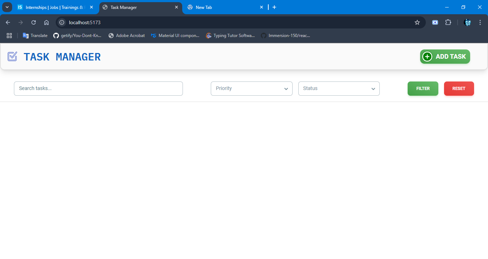
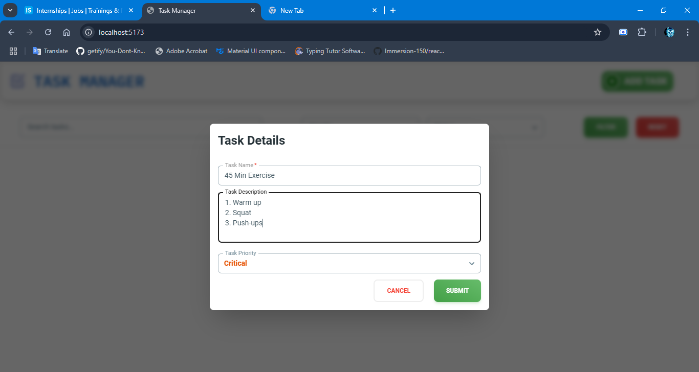
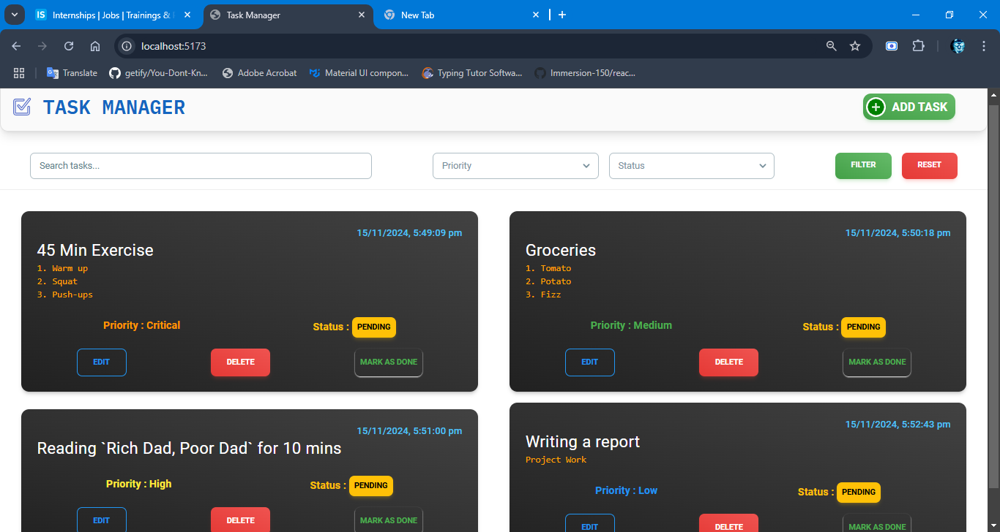
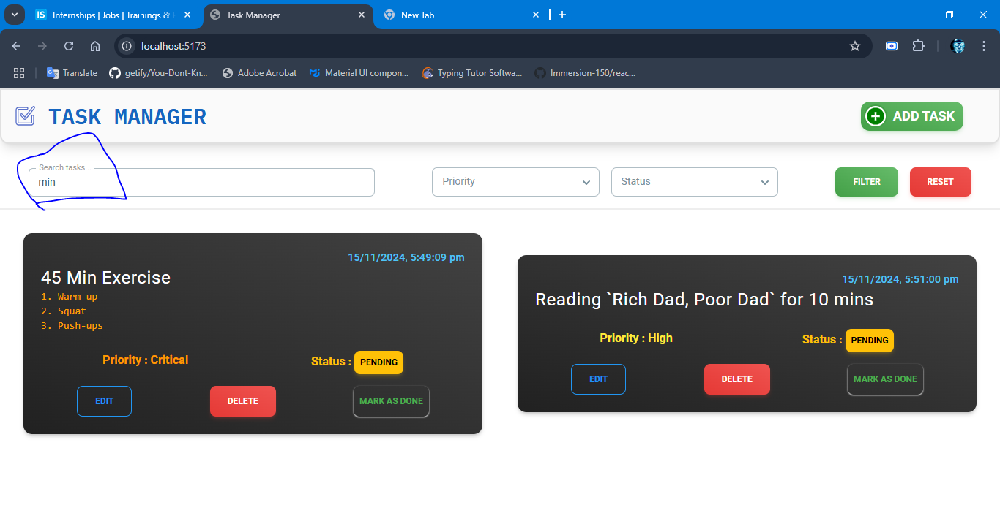
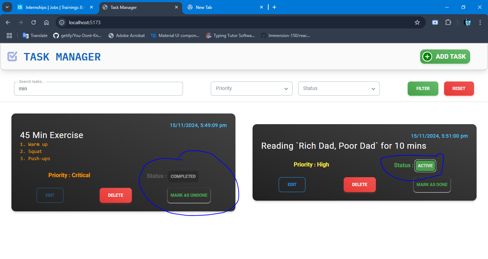
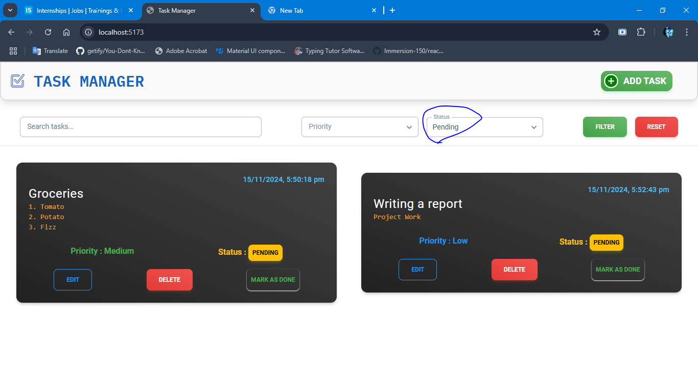
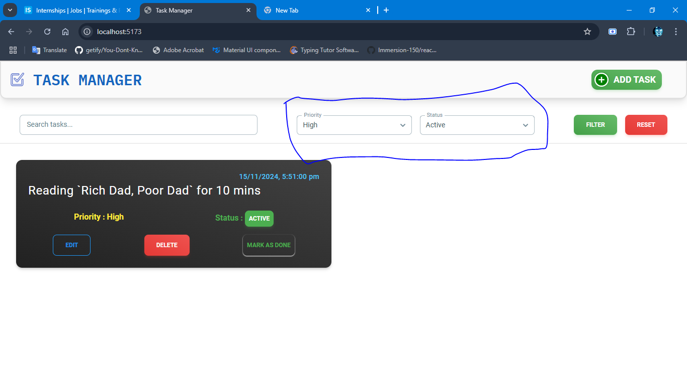
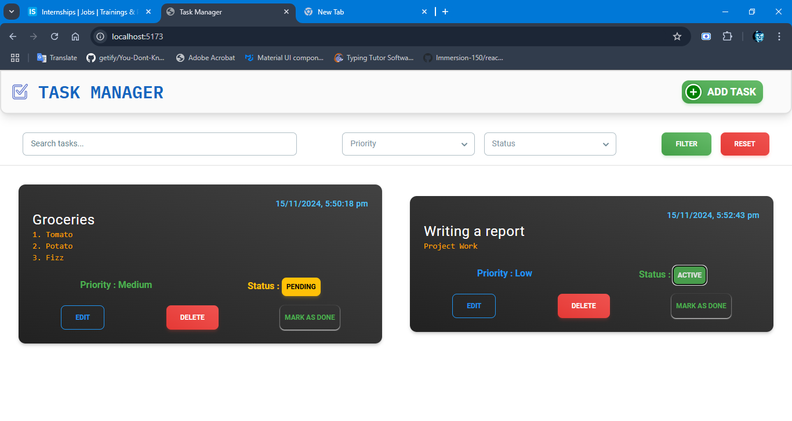
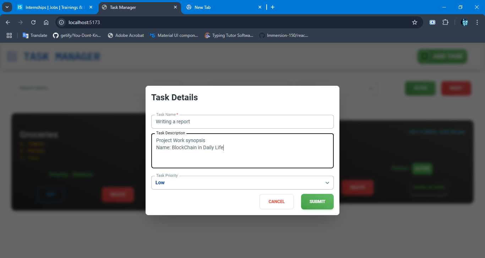
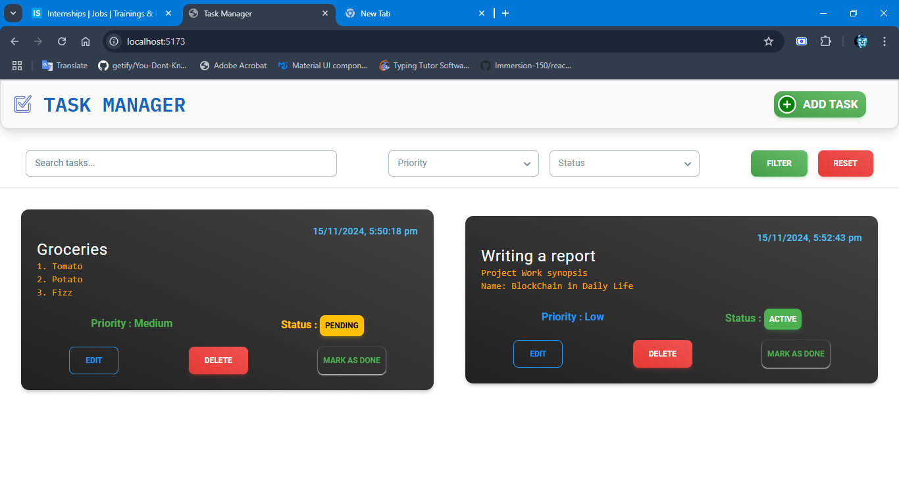

# [Task Manager]()
It's a simple task-management react app with functions like
 - Add Task
 - Search Tasks
 - Filter Tasks
 - Update Tasks
 - Persist Tasks using LocalStorage
 - Delete Tasks


## Prerequisites

Before you start, ensure you have Node.js installed on your machine. If not, you can download and install it from [here](https://nodejs.org/).


## Installation

1. Clone the repository:

```bash
git clone https://github.com/avi074/Task_Manager.git
```

2. Navigate into the project directory:

```bash
cd Task_Manager
```

3. Install dependencies:

```bash
npm install
```

## Usage

To start the project, open the Folder in IDE & run

```bash
npm run dev
```

To build your project for production:

```bash
npm run build
```

## Folder Structure

- `public/` : Contains your public files.

- `src/` : Contains your JSX/Source files 
    - `assets/` : Assets
    - `components/` : React Components
    - `utils/` : Utilities & Constants

- `index.html` : Index HTML file

## Screenshots

- Task Manager Layout


- Creating a Task


- Layout after some tasks created


- Task searching


- Changing task status 


- Sorting through status


- Filtering tasks by priority & status


- After deleting 2 tasks


- Editing a Task



## Contributing

Pull requests are welcome. For major changes, please open an issue first to discuss what you would like to change.

## License

[MIT]()